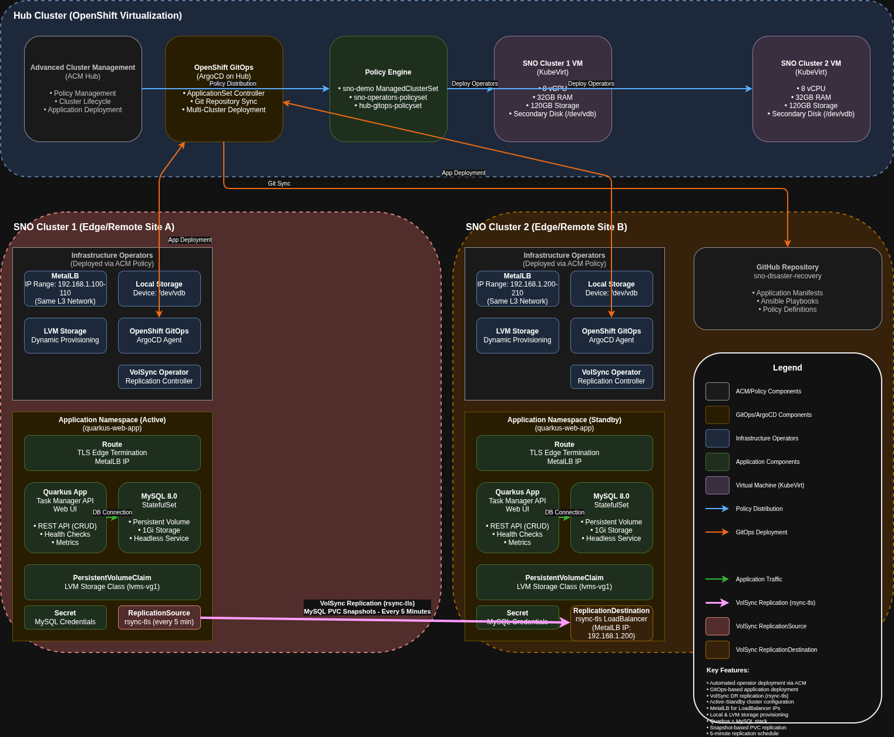
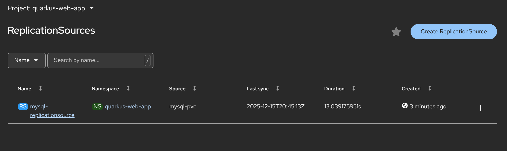
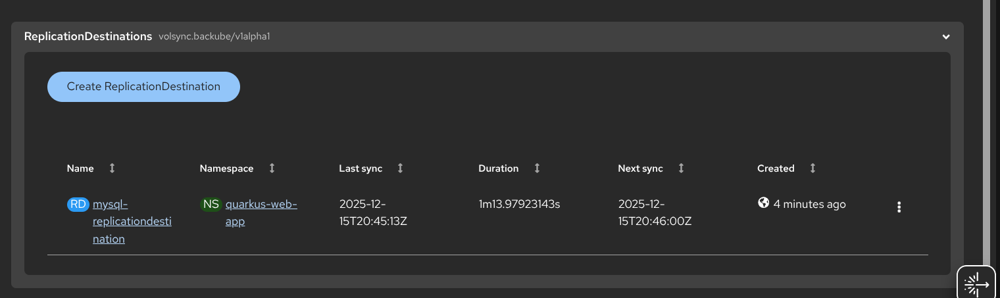
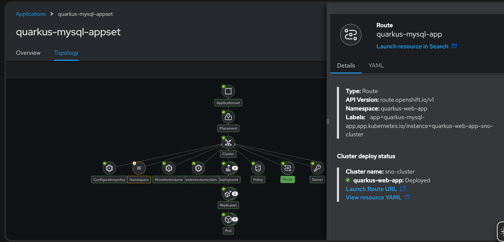
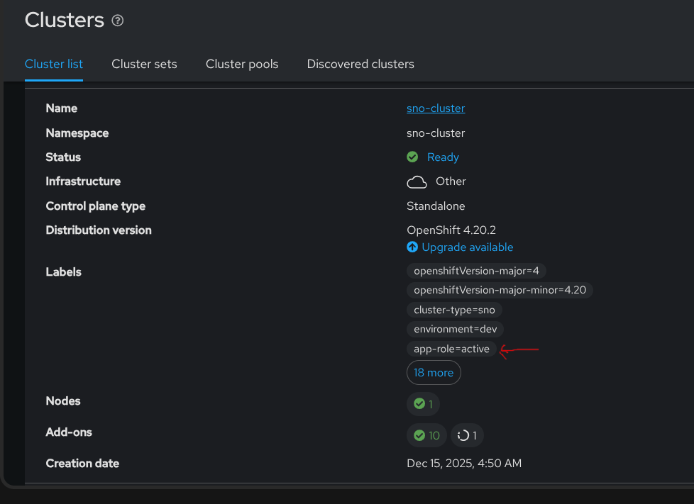

# Single Node OpenShift - Disaster Recovery Example

This Ansible automation demonstrates **Disaster Recovery (DR) for applications across two Single Node OpenShift (SNO) clusters** deployed on OpenShift Virtualization (KubeVirt).

## Architecture

  


## Quick Start

Complete end-to-end deployment in 5 steps:

```bash
# 1. Initial setup - build container image
./setup.sh

# 2. Configure authentication
export KUBECONFIG=~/.kube/config  # Point to your hub cluster

# 3. Deploy two SNO clusters (30-60 minutes each)
./ansible-runner.sh deploy

# 4. Deploy infrastructure operators (MetalLB, LVM, GitOps, VolSync)
./ansible-runner.sh operators

# 5. Deploy application with disaster recovery
./ansible-runner.sh deployapp
```

**That's it!** You now have:
- Two SNO clusters with full operator stack
- Active-Standby application configuration
- Automated VolSync replication (every 5 minutes)
- ArgoCD managing application lifecycle










## Purpose

This project showcases a complete DR strategy for applications running on edge/remote SNO clusters:

- **Infrastructure as Code**: Automated deployment of two SNO clusters on OpenShift Virtualization
- **Application Deployment**: Sample Quarkus web application with MySQL backend for DR testing
- **Network Connectivity**: MetalLB for LoadBalancer services and external access
- **Storage Management**: Configurable local storage and LVM operators for persistent data
- **GitOps Integration**: OpenShift GitOps (Argo CD) for declarative application deployment
- **Advanced Cluster Management (ACM)**: Centralized policy-based operator and configuration deployment
- **VolSync Replication**: Automated PVC replication between active and standby clusters

## Overview

This automation handles the complete deployment lifecycle:
- Prerequisites validation (namespace, storage, secrets)
- OpenShift installation preparation (install-config, ISO generation)
- Virtual Machine creation with proper resources
- Installation monitoring and cluster validation
- Credential extraction and artifact storage
- ACM policy deployment for operators (MetalLB, Local Storage, LVM, OpenShift GitOps, VolSync)

## Prerequisites

### On the Host OpenShift Cluster

1. **OpenShift Virtualization** installed and configured
2. **Storage Class** available for persistent volumes (e.g., OCS, NFS)
3. **Sufficient resources**:
   - CPU: 8+ cores available
   - Memory: 32+ GB available
   - Storage: 120+ GB available

### On the Control Node (Your Workstation/Bastion)

**No Ansible installation required!** This automation uses Podman to run Ansible in a container.

1. **Podman** installed (or Docker):
   ```bash
   # RHEL/Fedora/CentOS
   sudo dnf install -y podman
   
   # Ubuntu/Debian
   sudo apt install -y podman
   ```

2. **OpenShift CLI** (optional but recommended):
   - `oc` command-line tool for getting tokens
   - Download from: https://mirror.openshift.com/pub/openshift-v4/clients/ocp/

### Required Files

1. **Pull Secret** from Red Hat:
   - Download from: https://console.redhat.com/openshift/install/pull-secret
   - Save as: `pull-secret.json` in the project directory

2. **SSH Public Key**:
   - Generate: `ssh-keygen -t rsa -b 4096 -f ~/.ssh/id_rsa`
   - Save public key as: `ssh-key.pub` in the project directory

3. **OpenShift Access** (for ACM integration):
   
   Choose one of these authentication methods:
   
   **Option A: Kubeconfig (Recommended)**
   ```bash
   # Use existing kubeconfig for hub cluster
   export KUBECONFIG=~/.kube/config
   
   # Or place in project directory
   cp ~/.kube/config ./kubeconfig
   ```
   
   **Option B: API Token**
   ```bash
   # Login to your OpenShift hub cluster
   oc login https://api.your-hub-cluster.example.com:6443
   
   # Get token
   export OPENSHIFT_TOKEN=$(oc whoami -t)
   ```

## Configuration

### Basic Configuration

Edit `inventory/group_vars/all.yml`:

```yaml
# Authentication: Use kubeconfig OR token
# Priority: kubeconfig > token

# OpenShift API URL (required for token authentication)
openshift_api_url: "https://api.your-cluster.example.com:6443"

# Token authentication (set via OPENSHIFT_TOKEN env var)
# OR
# Kubeconfig authentication (set via KUBECONFIG env var or place at ./kubeconfig)

# SNO Cluster Configuration
sno_cluster_name: "sno-cluster"
sno_base_domain: "example.com"
sno_namespace: "sno-clusters"

# VM Specifications (for OpenShift Virtualization)
sno_vm_cores: 8
sno_vm_memory: "32Gi"
sno_vm_disk_size: "120Gi"

# Storage
sno_storage_class: "ocs-storagecluster-ceph-rbd"

# OpenShift Version
sno_openshift_version: "4.14.8"
```

### Per-Cluster Configuration

Edit `inventory/host_vars/sno-cluster-01.yml` for cluster-specific settings:

```yaml
sno_cluster_name: "sno-cluster-01"
sno_base_domain: "lab.example.com"
sno_vm_cores: 16
sno_vm_memory: "64Gi"
```

## Usage

### 1. Initial Setup

Run the setup script to build the Ansible container image:

```bash
./setup.sh
```

This will:
- Check for Podman installation
- Build the Ansible runner container image
- Validate prerequisites

### 2. Prepare Credentials

```bash
# Hub cluster authentication
export KUBECONFIG=~/.kube/config
# OR
export OPENSHIFT_TOKEN=$(oc whoami -t)

# Ensure pull secret exists
ls -l pull-secret.json

# Ensure SSH key exists
ls -l ssh-key.pub
```

**Note:** The automation will automatically detect and use kubeconfig if available, otherwise it will fall back to token authentication.

### 3. Deploy SNO Cluster

```bash
# Deploy cluster on OpenShift Virtualization
./ansible-runner.sh deploy

# Deploy specific cluster
./ansible-runner.sh deploy --limit sno-cluster-01

# Deploy with verbose output
./ansible-runner.sh deploy -v
```

### 4. Monitor Installation

The playbook will:
1. Validate prerequisites
2. Generate installation files and ISO
3. Create the VM on OpenShift Virtualization
4. Boot from installation ISO
5. Monitor bootstrap and installation progress
6. Extract credentials when complete

Installation typically takes 30-60 minutes.

### 5. Access the Cluster

After successful installation, credentials are saved in:
```
artifacts/sno-cluster-01/
├── kubeconfig
├── kubeadmin-password
└── cluster-info.txt
```

Access the cluster:
```bash
# Export kubeconfig
export KUBECONFIG=artifacts/sno-cluster-01/kubeconfig

# Verify cluster
oc get nodes
oc get co

# Access console
# URL: https://console-openshift-console.apps.<cluster-name>.<base-domain>
# User: kubeadmin
# Password: contents of artifacts/sno-cluster-01/kubeadmin-password
```

### 6. Deploy ACM and Operators

After deploying SNO clusters, deploy ACM policies for operator management:

```bash
# Deploy ACM policies for infrastructure operators
./ansible-runner.sh operators

# This will install:
# - MetalLB operator
# - Local Storage operator (if secondary disk configured)
# - LVM Storage operator
# - OpenShift GitOps operator (on hub and SNO clusters)
# - VolSync operator for disaster recovery
```

### 7. Deploy Applications

Deploy the sample Quarkus MySQL application via ACM and ArgoCD:

```bash
# Deploy application using GitOps
./ansible-runner.sh deployapp

# This creates:
# - ACM Application resource
# - ArgoCD ApplicationSet
# - Application deployed to all SNO clusters
```

## Testing the Disaster Recovery Setup

### Verify the Deployment

```bash
# 1. Check both SNO clusters are healthy
export KUBECONFIG=artifacts/sno-cluster/kubeconfig
oc get nodes
oc get co  # All operators should be Available

export KUBECONFIG=artifacts/sno-cluster2/kubeconfig
oc get nodes
oc get co

# 2. Verify VolSync replication on active cluster
export KUBECONFIG=artifacts/sno-cluster/kubeconfig  # Active cluster
oc get replicationsource -n quarkus-web-app
oc describe replicationsource mysql-replicationsource -n quarkus-web-app
# Look for: Status should show "Synchronizing" or "Completed"

# 3. Verify VolSync destination on standby cluster
export KUBECONFIG=artifacts/sno-cluster2/kubeconfig  # Standby cluster
oc get replicationdestination -n quarkus-web-app
oc describe replicationdestination mysql-replicationdestination -n quarkus-web-app
# Look for: LoadBalancer address and "Ready" status

# 4. Access the application on active cluster
export KUBECONFIG=artifacts/sno-cluster/kubeconfig
oc get route -n quarkus-web-app
# Open the route URL in your browser
```

### Test Data Replication

```bash
# 1. Add data on the active cluster
export KUBECONFIG=artifacts/sno-cluster/kubeconfig
APP_URL=$(oc get route quarkus-web-app -n quarkus-web-app -o jsonpath='{.spec.host}')

# Create test tasks via API
curl -X POST https://${APP_URL}/api/tasks \
  -H "Content-Type: application/json" \
  -d '{"title":"Test Task 1","description":"Testing DR replication"}'

curl -X POST https://${APP_URL}/api/tasks \
  -H "Content-Type: application/json" \
  -d '{"title":"Test Task 2","description":"This should replicate"}'

# Verify data was created
curl https://${APP_URL}/api/tasks

# 2. Wait 5 minutes for VolSync to replicate (check schedule: */5 * * * *)
echo "Waiting for replication cycle (5 minutes)..."

# 3. Monitor replication status
oc get replicationsource mysql-replicationsource -n quarkus-web-app -o jsonpath='{.status.lastSyncTime}'
# Timestamp should update after replication completes
```

### Test Failover Scenario

```bash
# 1. Scale down application on active cluster (simulate failure)
export KUBECONFIG=artifacts/sno-cluster/kubeconfig
oc scale deployment quarkus-web-app -n quarkus-web-app --replicas=0
oc scale deployment mysql -n quarkus-web-app --replicas=0

# 2. Update ACM to make standby cluster active
# Re-run deployapp and select the other cluster as active
./ansible-runner.sh deleteapp
./ansible-runner.sh deployapp
# When prompted, select the standby cluster (sno-cluster2) as the new active cluster

# 3. Verify data is available on the new active cluster
export KUBECONFIG=artifacts/sno-cluster2/kubeconfig
APP_URL=$(oc get route quarkus-web-app -n quarkus-web-app -o jsonpath='{.spec.host}')
curl https://${APP_URL}/api/tasks
# Should show the tasks created earlier
```

### 8. Destroy Cluster

```bash
# Delete all cluster resources
./ansible-runner.sh destroy

# Delete specific cluster
./ansible-runner.sh destroy --limit sno-cluster-01
```

### 9. Advanced Usage

```bash
# Build/rebuild the Ansible container image
./ansible-runner.sh build

# Run a custom playbook
./ansible-runner.sh run examples/custom-deployment.yml

# Open a shell in the Ansible container for debugging
./ansible-runner.sh shell

# View all available options
./ansible-runner.sh --help
```

## Advanced Configuration

### Finding RHCOS AMI IDs for AWS

To find the correct RHCOS AMI for your AWS region and OpenShift version:

1. Visit: https://mirror.openshift.com/pub/openshift-v4/x86_64/dependencies/rhcos/
2. Navigate to your OpenShift version (e.g., `4.20/`)
3. Open `rhcos-aws.json` or check AWS EC2 console under "Public images"
4. Search for: "Red Hat CoreOS" + your OpenShift version

Example AMI IDs (these change with each RHCOS release):
```yaml
# us-east-1 (N. Virginia)
aws_ami_id: "ami-0123456789abcdef0"

# us-west-2 (Oregon)  
aws_ami_id: "ami-abcdef0123456789"

# eu-west-1 (Ireland)
aws_ami_id: "ami-fedcba9876543210"
```

### AWS Resource Tagging

The automation automatically tags AWS resources for management:

```yaml
Tags:
  Name: "{{ sno_cluster_name }}"
  cluster: "{{ sno_cluster_name }}"
  openshift-version: "{{ sno_openshift_version }}"
  managed-by: ansible
```

Use these tags to:
- Track costs in AWS Cost Explorer
- Filter resources in AWS console
- Create automated cleanup scripts
- Implement resource policies

### Custom Network Configuration (OpenShift Virtualization)

Use NetworkAttachmentDefinitions for advanced networking:

```yaml
# In host_vars or group_vars
sno_network_attachment_definition: "sno-clusters/vlan100-network"
sno_vm_mac_address: "52:54:00:aa:bb:cc"  # Optional
```

**Steps:**

1. Create NetworkAttachmentDefinition:
   ```bash
   oc apply -f examples/network-attachment-definitions/vlan-network.yaml
   ```

2. Reference it in your configuration:
   ```yaml
   # inventory/host_vars/sno-cluster-01.yml
   sno_network_attachment_definition: "sno-clusters/vlan100-network"
   ```

3. Deploy:
   ```bash
   ./ansible-runner.sh deploy --limit sno-cluster-01
   ```

See `examples/network-attachment-definitions/` for NAD examples.

### Using Pre-Generated ISO

If you have a pre-generated ISO:

```yaml
sno_generate_iso: false
sno_iso_url: "http://fileserver.example.com/rhcos-sno.iso"
```

### Custom Install Config

Edit `roles/sno_prepare_installation/templates/install-config.yaml.j2` to customize:
- Network CIDR ranges
- Proxy settings
- Additional manifests
- Platform-specific settings

## Troubleshooting

### Authentication Issues

**Hub cluster authentication:**
```bash
# Verify kubeconfig is accessible
echo $KUBECONFIG
cat $KUBECONFIG

# Test connection
oc get nodes

# Inside container
./ansible-runner.sh shell
ls -l /tmp/kubeconfig
```

**Using token:**
```bash
# Verify token is set
echo $OPENSHIFT_TOKEN

# Test token
oc whoami

# Refresh token if expired
export OPENSHIFT_TOKEN=$(oc whoami -t)
```

**AWS authentication:**
```bash
# Verify AWS credentials
echo $AWS_ACCESS_KEY_ID
echo $AWS_PROFILE

# Test AWS access
aws sts get-caller-identity --region us-east-1

# Inside container
./ansible-runner.sh shell
env | grep AWS
```

### Check VM Status (OpenShift Virtualization)

```bash
oc get vm -n sno-clusters
oc get vmi -n sno-clusters
```

### Access VM Console (OpenShift Virtualization)

```bash
virtctl console <vm-name> -n sno-clusters
```

### Check EC2 Instance (AWS)

```bash
# List EC2 instances
aws ec2 describe-instances \
  --filters "Name=tag:cluster,Values=sno-aws-01" \
  --region us-east-1 \
  --query 'Reservations[*].Instances[*].[InstanceId,State.Name,PublicIpAddress]'

# SSH to instance
ssh -i ~/.ssh/your-keypair.pem core@<elastic-ip>

# View console output
aws ec2 get-console-output --instance-id <instance-id> --region us-east-1
```

### View Installation Logs

```bash
# On the control node
tail -f /tmp/sno-install-<cluster-name>/.openshift_install.log
```

### Common Issues

1. **Storage class not found** (OpenShift Virtualization):
   - Verify storage class exists: `oc get sc`
   - Update `sno_storage_class` variable

2. **Insufficient resources** (OpenShift Virtualization):
   - Check available resources on worker nodes
   - Reduce `sno_vm_cores` and `sno_vm_memory` if needed

3. **Network connectivity**:
   - OpenShift Virt: Access VM console to check progress
   - AWS: Check security group rules, verify Elastic IP assigned
   - Verify Route53 DNS records (AWS) or NetworkAttachmentDefinition (OpenShift Virt)

4. **AWS-specific issues**:
   - **AMI not found**: Verify `aws_ami_id` is correct for your region
   - **VPC/Subnet errors**: Ensure VPC and subnet have internet connectivity
   - **Security group rules**: Must allow ports 6443, 22, 80, 443, 22623
   - **Route53 zone not found**: Verify `aws_route53_zone` exists in your account
   - **Instance launch failed**: Check EC2 instance limits and available capacity
   - **Elastic IP limit**: You may need to request EIP limit increase

5. **NetworkAttachmentDefinition not found** (OpenShift Virtualization):
   - Verify NAD exists: `oc get network-attachment-definitions -n <namespace>`
   - Check NAD name format: `namespace/name` or just `name` (uses VM namespace)
   - Create NAD using examples in `examples/network-attachment-definitions/`

6. **Bootstrap timeout**:
   - OpenShift Virt: Access VM console to check progress
   - AWS: Check EC2 console output, verify network connectivity
   - Verify network connectivity
   - Check ignition configuration

## Project Structure

```
.
├── Containerfile                        # Ansible container image definition
├── ansible-runner.sh                    # Podman-based Ansible runner (main interface)
├── setup.sh                            # Initial setup script
├── ansible.cfg                          # Ansible configuration
├── requirements.yml                     # Ansible collection requirements
├── deploy-sno.yml                       # OpenShift Virtualization deployment playbook
├── deploy-sno-aws.yml                   # AWS deployment playbook
├── destroy-sno.yml                      # Cleanup playbook (OpenShift Virtualization)
├── acm-deploy-infrastructure.yml        # ACM policy deployment for operators
├── acm-deploy-application.yml           # ACM application deployment via GitOps
├── architecture-diagram.drawio          # Architecture diagram
├── inventory/
│   ├── hosts                           # Inventory file
│   ├── group_vars/
│   │   └── all.yml                     # Global variables
│   └── host_vars/
│       ├── sno-cluster-01.yml          # OpenShift Virt cluster variables
│       └── sno-aws-example.yml         # AWS cluster example configuration
├── roles/
│   ├── sno_prerequisites/              # Prerequisites validation
│   ├── sno_prepare_installation/       # Installation preparation
│   ├── sno_create_vm/                  # VM creation (OpenShift Virtualization)
│   └── sno_monitor_installation/       # Installation monitoring
├── app/                                 # Sample Quarkus MySQL application
│   ├── pom.xml                         # Maven dependencies
│   ├── src/                            # Java source code
│   ├── openshift/                      # OpenShift manifests
│   └── Dockerfile.native               # Native image Dockerfile
├── examples/
│   ├── custom-deployment.yml           # Custom deployment example
│   ├── multi-cluster-deployment.yml    # Multiple clusters
│   ├── network-attachment-definitions/ # NAD examples for custom networking
│   └── host_vars/                      # Example host configurations
└── artifacts/                           # Generated cluster credentials
    └── <cluster-name>/
        ├── kubeconfig
        ├── kubeadmin-password
        └── cluster-info.txt
```

## Complete Deployment Examples

### Example 1: Single SNO on OpenShift Virtualization

```bash
# 1. Configure cluster
cat > inventory/host_vars/sno-cluster-01.yml <<EOF
sno_cluster_name: "sno-cluster-01"
sno_base_domain: "lab.example.com"
sno_vm_cores: 16
sno_vm_memory: "64Gi"
metallb_ip_address_ranges:
  - "192.168.1.100-192.168.1.110"
EOF

# 2. Deploy cluster
export KUBECONFIG=~/.kube/config
./ansible-runner.sh deploy --limit sno-cluster-01

# 3. Wait for installation (30-60 minutes)

# 4. Deploy operators via ACM
./ansible-runner.sh operators --limit sno-cluster-01

# 5. Deploy application via GitOps
./ansible-runner.sh deployapp
```

### Example 2: DR Setup with Two SNO Clusters (One on AWS, One on OpenShift Virt)

```bash
# 1. Configure OpenShift Virt cluster
cat > inventory/host_vars/sno-cluster-01.yml <<EOF
sno_cluster_name: "sno-cluster-01"
sno_base_domain: "lab.example.com"
sno_vm_cores: 16
sno_vm_memory: "64Gi"
metallb_ip_address_ranges:
  - "192.168.1.100-192.168.1.110"
EOF

# 2. Configure AWS cluster
cat > inventory/host_vars/sno-aws-01.yml <<EOF
sno_cluster_name: "sno-aws-01"
sno_base_domain: "example.com"
aws_region: "us-east-1"
aws_instance_type: "m5.4xlarge"
aws_ami_id: "ami-0123456789abcdef0"
aws_vpc_id: "vpc-xxxxxxxxxxxxxxxxx"
aws_subnet_id: "subnet-xxxxxxxxxxxxxxxxx"
aws_security_group_id: "sg-xxxxxxxxxxxxxxxxx"
aws_key_name: "my-keypair"
aws_route53_zone: "example.com"
aws_create_eip: true
sno_secondary_disk_device: "/dev/nvme1n1"
metallb_ip_address_ranges:
  - "10.0.1.100-10.0.1.110"
EOF

# 3. Deploy both clusters
export KUBECONFIG=~/.kube/config
export AWS_ACCESS_KEY_ID="your-access-key"
export AWS_SECRET_ACCESS_KEY="your-secret-key"

./ansible-runner.sh deploy --limit sno-cluster-01
./ansible-runner.sh deployaws --limit sno-aws-01

# 4. Wait for both installations

# 5. Deploy operators to both clusters
./ansible-runner.sh operators

# 6. MetalLB will be configured with cluster-specific IP ranges

# 7. Deploy application to both clusters
./ansible-runner.sh deployapp

# 8. Verify DR setup
export KUBECONFIG=artifacts/sno-cluster-01/kubeconfig
oc get pods -n quarkus-mysql-app

export KUBECONFIG=artifacts/sno-aws-01/kubeconfig
oc get pods -n quarkus-mysql-app
```

### Example 3: AWS-Only Deployment

```bash
# 1. Configure AWS cluster
cat > inventory/host_vars/sno-aws-prod.yml <<EOF
sno_cluster_name: "sno-aws-prod"
sno_base_domain: "prod.example.com"
aws_region: "us-west-2"
aws_availability_zone: "us-west-2a"
aws_instance_type: "m5.4xlarge"
aws_ami_id: "ami-0fedcba9876543210"
aws_vpc_id: "vpc-prod123456"
aws_subnet_id: "subnet-prod78901"
aws_security_group_id: "sg-prod23456"
aws_key_name: "prod-keypair"
aws_route53_zone: "prod.example.com"
aws_create_eip: true
sno_secondary_disk_device: "/dev/nvme1n1"
sno_openshift_version: "4.20.2"
EOF

# 2. Set credentials
export KUBECONFIG=~/.kube/hub-cluster-config
export AWS_PROFILE="production"

# 3. Deploy
./ansible-runner.sh deployaws --limit sno-aws-prod

# 4. Monitor EC2 instance
aws ec2 describe-instances \
  --filters "Name=tag:cluster,Values=sno-aws-prod" \
  --region us-west-2 \
  --query 'Reservations[*].Instances[*].[InstanceId,State.Name,PublicIpAddress]'

# 5. Access cluster after installation
export KUBECONFIG=artifacts/sno-aws-prod/kubeconfig
oc get nodes
```

## Security Considerations

1. **Protect credentials**:
   - Never commit `pull-secret.json` or `ssh-key.pub` to version control
   - Use `.gitignore` for sensitive files
   - Restrict access to `artifacts/` directory
   - Rotate AWS credentials regularly

2. **OpenShift token**:
   - Use environment variables for tokens
   - Rotate tokens regularly
   - Use service accounts for automation

3. **AWS security**:
   - Use IAM roles instead of access keys when possible
   - Implement least-privilege security groups
   - Enable VPC Flow Logs for network monitoring
   - Use AWS Secrets Manager for sensitive data
   - Enable CloudTrail for API auditing

4. **Network security**:
   - Use NetworkPolicies to isolate SNO VM
   - Configure proper firewall rules
   - Use TLS for all communications
   - Restrict MetalLB IP ranges to required addresses only

## Why Podman-based?

This automation uses Podman to run Ansible in a container, providing several benefits:

1. **No Local Installation**: No need to install Ansible, Python packages, or collections on your system
2. **Consistency**: Same environment across all users and systems
3. **Isolation**: Dependencies don't conflict with system packages
4. **Portability**: Works on any system with Podman/Docker
5. **Easy Updates**: Rebuild the container to update dependencies

## Troubleshooting

### Podman Issues

**Permission denied errors**:
```bash
# Run podman in rootless mode (default) or with sudo
sudo ./ansible-runner.sh deploy
```

**SELinux issues with volume mounts**:
- The `:Z` flag is used automatically for proper SELinux labeling
- If issues persist, check `sudo ausearch -m avc -ts recent`

**Image build fails**:
```bash
# Rebuild with no cache
podman build --no-cache -t localhost/ansible-runner:latest -f Containerfile .
```

### Container environment

**Need to debug inside the container**:
```bash
./ansible-runner.sh shell
# Now you're inside the container
ansible --version
ls -la /workspace
```

## Support and Contributions

For issues, questions, or contributions:
- Review the OpenShift documentation: https://docs.openshift.com
- Check OpenShift Virtualization docs: https://docs.openshift.com/container-platform/latest/virt/about-virt.html
- Review Single Node OpenShift documentation

## License

This automation is provided as-is for educational and operational purposes.
