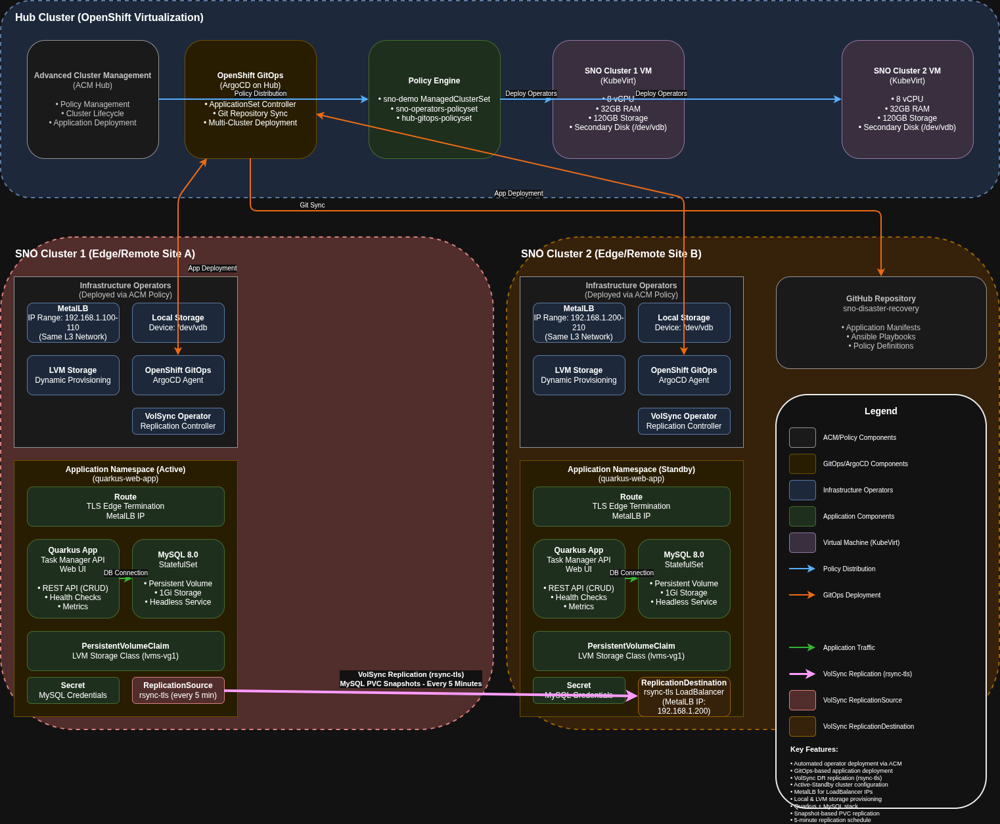
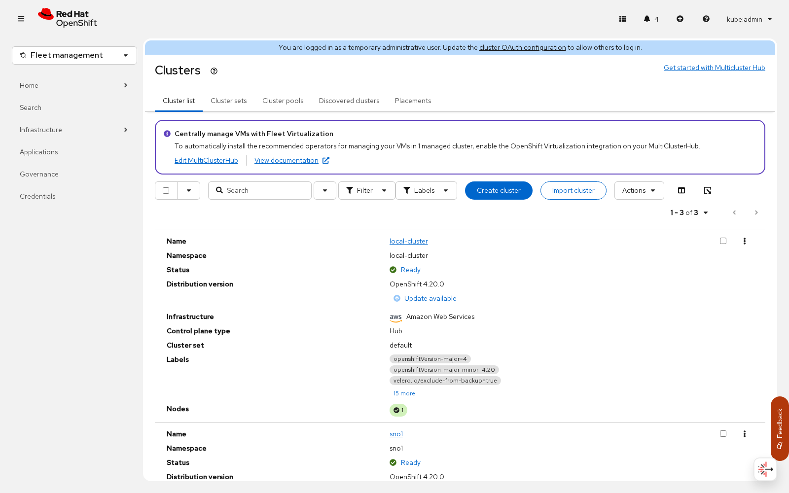
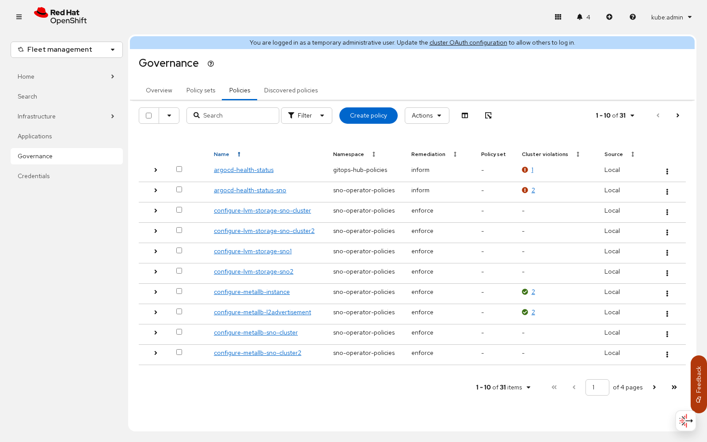
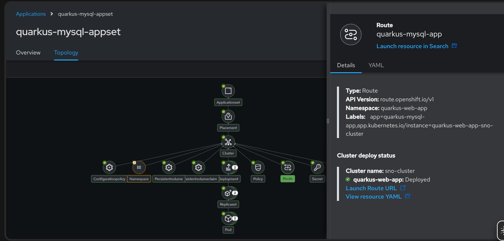
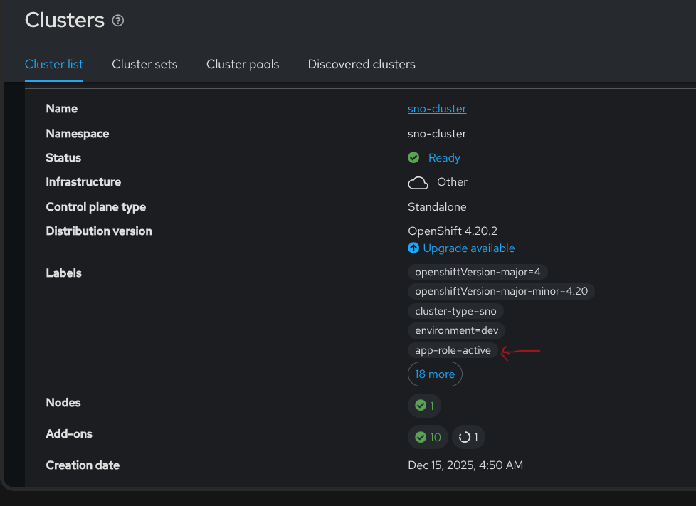

# Single Node OpenShift — Application Disaster Recovery

This Ansible automation stands up **two Single Node OpenShift (SNO) clusters** and
demonstrates **automated application Disaster Recovery (DR)** between them: an
active/standby Quarkus + MySQL app whose data is replicated with VolSync and whose
failover/failback is driven entirely by **Red Hat Advanced Cluster Management (ACM)
policies** and **OpenShift GitOps (ArgoCD)**.

The two SNO clusters can each be created on **either platform** — as VMs on an
existing **OpenShift Virtualization** host, or as native **AWS IPI** clusters — and
mixed freely (e.g. one on-prem, one in AWS). Once the clusters exist, **the rest of
the workflow is identical** regardless of where they run.

## Architecture



## Two ways to create infrastructure (and one common flow)

Repo provides support for 2 infrastructure types:

| | OpenShift Virtualization | AWS IPI |
|---|---|---|
| **Command** | `./ansible-runner.sh deploy` | `./ansible-runner.sh aws-deploy` |
| **Where it runs** | Ansible **in a Podman container** | Ansible **directly on the host** |
| **Needs a kubeconfig?** | **Yes** — builds VMs on an *existing* hub OCP cluster | **No** — `openshift-install` creates the cluster from scratch |
| **Key tooling** | Podman + `oc` / k8s modules (in the image) | `openshift-install` + `aws` CLI + `~/.aws` (on the host) |
| **Playbook** | `deploy-sno.yml` | `deploy-sno-aws.yml` |

> **Why the split?** The container-based flow (`build`/`deploy`/`destroy`) exists to
> create SNO **VMs on top of an OpenShift cluster you already have** — so it mounts a
> kubeconfig and talks to that hub's API. The AWS flow provisions a brand-new cluster
> with `openshift-install`, which needs the `aws` CLI and `~/.aws` credentials that do
> **not** exist inside the container — so it runs on the host and needs **no
> kubeconfig at all**. Running an AWS playbook through the container is blocked with a
> clear error for exactly this reason.

After the clusters are up, the **common** commands (`acmimport`, `operators`,
`deployapp`, …) run against clusters from *either* platform.

```
┌─ Create infrastructure (pick per cluster) ─────────────────────────────┐
│                                                                        │
│   OpenShift Virtualization          AWS IPI                            │
│   ./ansible-runner.sh deploy        ./ansible-runner.sh aws-deploy     │
│   (container, needs hub kubeconfig) (host, needs aws creds)            │
│                                                                        │
└───────────────────────────────┬────────────────────────────────────────┘
                                │  clusters now exist + imported to ACM
                                ▼
┌─ Common end-to-end flow (same for both platforms) ─────────────────────┐
│   operators → deployapp → test replication → failover                  │
│   (operators installs ACM on the hub, imports clusters, deploys the    │
│    operator stack; use deploycnv + deployvm for the VM workload)       │
└────────────────────────────────────────────────────────────────────────┘
```

---

## Prerequisites

### Control node (your workstation / bastion) — always

| Tool | OpenShift Virt flow | AWS flow |
|---|---|---|
| **Podman** (runs Ansible in a container) | ✅ required | — |
| **`oc`** CLI | recommended | recommended |
| **`ansible-playbook`** on the host | — | ✅ required |
| **`openshift-install`** on the host | — | ✅ required |
| **`aws`** CLI on the host | — | ✅ required |

```bash
# Podman (OpenShift Virt flow)
sudo dnf install -y podman          # RHEL/Fedora
sudo apt install -y podman          # Debian/Ubuntu

# Host tools (AWS flow)
sudo dnf install -y ansible-core awscli
# openshift-install: download for your version from
#   https://mirror.openshift.com/pub/openshift-v4/clients/ocp/
```

### Required files (both flows)

1. **Pull secret** — download from
   <https://console.redhat.com/openshift/install/pull-secret> and save as
   `pull-secret.json` in the repo root.
2. **SSH public key** — `ssh-keygen -t rsa -b 4096 -f ~/.ssh/id_rsa` and copy the
   public key to `ssh-key.pub` in the repo root.

### Platform credentials

**OpenShift Virtualization** — a kubeconfig (or token) for the **existing hub OCP
cluster** the VMs will run on:

```bash
export KUBECONFIG=~/.kube/config        # or place a file at ./kubeconfig
# or:  export OPENSHIFT_TOKEN=$(oc whoami -t)
```

**AWS** — credentials for each target account. The cleanest approach is a **named
profile per cluster** set as `aws_profile` in that cluster's host_vars (mapping to a
section in `~/.aws/credentials`); ambient `AWS_PROFILE` / `AWS_ACCESS_KEY_ID` also
work. The base domain must be a **public Route53 hosted zone** in the account.

```bash
# ~/.aws/credentials
[sno1]
aws_access_key_id = AKIA...
aws_secret_access_key = ...
```

---

## Step 1 — Create the infrastructure

You need **two** SNO clusters. Create each one with whichever flow fits — they can be
on different platforms.

### Option A — OpenShift Virtualization (container flow)

Define the cluster(s) in `inventory/host_vars/<name>.yml` and list them in the
`[sno_clusters]` group in `inventory/hosts`:

```yaml
# inventory/host_vars/sno-cluster-01.yml
sno_cluster_name: "sno-cluster-01"
sno_base_domain: "lab.example.com"
sno_vm_cores: 16
sno_vm_memory: "64Gi"
sno_vm_disk_size: "120Gi"
sno_storage_class: "ocs-storagecluster-ceph-rbd"
metallb_ip_address_ranges:
  - "192.168.1.100-192.168.1.110"
```

```bash
# One-time: build the Ansible container image
./setup.sh                                  # or: ./ansible-runner.sh build

# Point at the EXISTING hub cluster the VMs run on
export KUBECONFIG=~/.kube/config

# Deploy (30–60 min per cluster). --limit picks a single host.
./ansible-runner.sh deploy --limit sno-cluster-01
```

Credentials for each finished cluster land in `artifacts/<cluster-name>/`
(`kubeconfig`, `kubeadmin-password`, `cluster-info.txt`).

### Option B — AWS IPI (host flow)

Define the cluster(s) in `inventory/host_vars/<name>.yml` and list them in the
`[sno_aws_clusters]` group in `inventory/hosts`:

```yaml
# inventory/host_vars/sno-aws-1.yml
sno_cluster_name: "sno-aws-1"
aws_profile: "sno1"          # named profile in ~/.aws/credentials (selects the account)
aws_region: "us-east-1"
# sno_base_domain is auto-discovered from the account's Route53 public zone
# if omitted; set it explicitly to pin a specific zone.
```

```bash
# Runs on the HOST (no container, no kubeconfig needed).
./ansible-runner.sh aws-deploy --limit sno-aws-1

# Deploy every AWS cluster at once:
./ansible-runner.sh aws-deploy
```

`openshift-install` provisions everything (VPC, subnets, security groups, the single
control-plane instance + temporary bootstrap, the API/Ingress load balancers, and the
Route53 records). Credentials also land in `artifacts/<cluster-name>/`.

> ⚠️ Do **not** run `./ansible-runner.sh deploy` or `run deploy-sno-aws.yml` for AWS —
> the container has no `openshift-install`/`aws` CLI and no `~/.aws` mount, and there
> is no pre-existing cluster to authenticate to. Use `aws-deploy` (the runner blocks
> the container path with an explanatory error).

### Verify the clusters

```bash
export KUBECONFIG=artifacts/sno-cluster-01/kubeconfig
oc get nodes          # one Ready node
oc get co             # all cluster operators Available
```

---

## Step 2 — Install ACM, import clusters, deploy operators

From here on, **the flow is the same for both platforms.** These commands run in the
container and talk to your **hub** cluster (the `acm-hub` cluster), so point
`KUBECONFIG` at it:

```bash
export KUBECONFIG=~/.kube/config     # the acm-hub cluster
```

The `operators` command does all three hub-side steps in one run:

```bash
./ansible-runner.sh operators
```

1. **Installs ACM** (the `advanced-cluster-management` operator + `MultiClusterHub`)
   on the **`acm-hub` cluster only**, if it isn't already present.
2. **Imports** every other cluster found under `credentials/` **or** `artifacts/`
   as an ACM managed cluster (the hub itself is excluded, never imported as a DR
   cluster).
3. Applies ACM policies that install the operator stack on the SNO clusters.

> Cluster kubeconfigs are discovered from **both** `credentials/<name>/auth/kubeconfig`
> (AWS IPI) and `artifacts/<name>/kubeconfig` (OpenShift Virtualization). You can also
> import separately with `./ansible-runner.sh acmimport` (requires ACM already
> installed).

The hub managing the SNO clusters as a fleet (hub + two SNO DR clusters):



The operator stack is applied to the SNO clusters as ACM **governance policies**:



The operator stack applied to the SNO clusters:

- **MetalLB** — LoadBalancer services (VolSync rsync endpoint, app route)
- **LVM Storage** / **Local Storage** — persistent volumes
- **OpenShift GitOps (ArgoCD)** — on the hub and the SNO clusters
- **VolSync** — PVC replication for DR
- **Submariner** — cross-cluster networking for the VolSync DR path when clusters are
  on non-shared subnets (e.g. one on-prem, one in AWS)

## Step 3 — Deploy the application with DR

```bash
# Interactive: pick which cluster is the initial ACTIVE
./ansible-runner.sh deployapp

# Non-interactive: name the active cluster directly
./ansible-runner.sh deployapp -e selected_cluster=sno-cluster-01
```

`deployapp` labels the chosen cluster `app-role=active` and the other(s)
`app-role=standby`, then ArgoCD renders the app to the active cluster and the ACM
policies stand up the VolSync `ReplicationSource` (active) and `ReplicationDestination`
(standby).



You now have:

- Two SNO clusters with the full operator stack
- An active/standby Quarkus + MySQL application
- Automated VolSync replication (every 5 minutes)
- ArgoCD managing the application lifecycle

### Alternative — a VirtualMachine workload instead of the app

If you'd rather test DR with an **OpenShift Virtualization VM** than the Quarkus app,
use `deployvm` in place of `deployapp`. It follows the identical active/standby +
VolSync design, but the workload is a Fedora VM whose **persistent data disk
(`vm-data-pvc`) is what VolSync replicates** — directly analogous to app-pod +
`mysql-pvc`:

```bash
# 1. Install OpenShift Virtualization on the SNO clusters (once). On AWS the
#    clusters must be bare-metal (*.metal) instances for KubeVirt to run VMs.
./ansible-runner.sh deploycnv

# 2. Deploy the VM DR stack. Interactive, or -e selected_cluster=<name>
./ansible-runner.sh deployvm
```

- The VM (`fedora-dr-vm`, namespace `vm-dr-demo`) is scheduled by ArgoCD to the
  **active** cluster only; boots from a public Fedora containerDisk.
- The data-disk PVC is deployed to **all** clusters; cloud-init formats it on first
  use, mounts it at `/mnt/data`, and appends a timestamped line to
  `/mnt/data/heartbeat.log` every minute — that log is the data you verify survived a
  failover.
- VolSync source/destination lifecycle is driven by `acm-policy-volsync-vm.yaml`
  (scoped to `vm-dr-demo`, with the same `Synchronizing=True` delete-guard on both
  source and destination).

```bash
# Verify on the active cluster
oc get vmi,replicationsource -n vm-dr-demo
virtctl console fedora-dr-vm -n vm-dr-demo      # login fedora/fedora, then:
#   cat /mnt/data/heartbeat.log
```

The VM running on the active cluster (Fedora, `vm-dr-demo`):


The heartbeat log on the VM's replicated data disk — the data you verify survives a
failover:


Fail over the same way — flip the `app-role` labels (Step 5) — and confirm the
heartbeat log on the new active cluster contains entries from before failover.

The ACM Applications topology for the `fedora-vm-appset` ApplicationSet before and
after a failover — the same VM tree migrates from **sno1** to **sno2** when the
`app-role` label flips (ArgoCD prunes it on the old active and syncs it on the new):

| Before failover (active = sno1) | After failover (active = sno2) |
|---|---|
|  |  |

> **Notes:** `deployvm` is an **alternative** to `deployapp` — deploy one DR stack at a
> time, not both (their cluster-scoped VolSync policies would otherwise overlap). The
> target SNO clusters must have **OpenShift Virtualization (CNV)** installed; on AWS
> that requires bare-metal (`*.metal`) instances. Tear down with
> `./ansible-runner.sh deletevm`.

---

## Step 4 — Verify replication

```bash
# ACTIVE cluster — the ReplicationSource pushes snapshots
export KUBECONFIG=artifacts/sno-cluster-01/kubeconfig
oc get replicationsource -n quarkus-web-app
```


```bash
# STANDBY cluster — the ReplicationDestination receives them
export KUBECONFIG=artifacts/sno-cluster-02/kubeconfig
oc get replicationdestination -n quarkus-web-app
```


Write some data on the active cluster and confirm the `lastSyncTime` advances:

```bash
export KUBECONFIG=artifacts/sno-cluster-01/kubeconfig
APP_URL=$(oc get route quarkus-web-app -n quarkus-web-app -o jsonpath='{.spec.host}')
curl -X POST https://${APP_URL}/api/tasks \
  -H "Content-Type: application/json" \
  -d '{"title":"Test Task 1","description":"Testing DR replication"}'

# after the next 5-minute cycle:
oc get replicationsource -n quarkus-web-app \
  -o jsonpath='{.items[0].status.lastSyncTime}{"\n"}'
```

---

## Step 5 — Fail over (and fail back)

Failover is a **label flip** on the hub — the ACM policies react and move the app and
the VolSync roles to the new active cluster. No re-deploy required.



```bash
export KUBECONFIG=~/.kube/config     # hub

# Promote the standby, demote the old active
oc label managedcluster sno-cluster-02 app-role=active  --overwrite
oc label managedcluster sno-cluster-01 app-role=standby --overwrite
```

The policies then:

1. Delete the `ReplicationSource` on the demoted cluster and the `ReplicationDestination`
   on the promoted cluster — **guarded so an in-flight sync is never torn down**
   (deletion is skipped while a resource reports `Synchronizing=True` and retried on a
   later policy pass once the transfer completes).
2. Recreate the destination on the new standby and the source on the new active after
   re-running the address/keySecret lookup.
3. ArgoCD moves the application to the new active cluster.

**Fail back** by flipping the labels the other way. Verify the data survived:

```bash
export KUBECONFIG=artifacts/sno-cluster-02/kubeconfig
APP_URL=$(oc get route quarkus-web-app -n quarkus-web-app -o jsonpath='{.spec.host}')
curl https://${APP_URL}/api/tasks     # tasks created earlier are present
```

> For a deep dive into the ACM policy set behind failover/failback, see
> [docs/VOLSYNC-FAILOVER-BLOG.md](docs/VOLSYNC-FAILOVER-BLOG.md).

---

## Tear down

```bash
# OpenShift Virtualization clusters (container flow)
./ansible-runner.sh destroy --limit sno-cluster-01

# AWS clusters (host flow — runs openshift-install destroy)
./ansible-runner.sh aws-destroy --limit sno-aws-1

# Remove the app / operators / cluster imports from ACM
./ansible-runner.sh deleteapp
./ansible-runner.sh deleteoperators
./ansible-runner.sh acmremove
```

---

## Command reference

Run `./ansible-runner.sh --help` for the full list. Grouped by role:

| Command | Runs where | Purpose |
|---|---|---|
| `build` | container | Build the Ansible runner image |
| `deploy` / `destroy` | container | Create/destroy SNO **VMs** on OpenShift Virtualization (needs hub kubeconfig) |
| `aws-deploy` / `aws-destroy` | **host** | Create/destroy SNO on **AWS IPI** (needs `openshift-install` + aws creds, **no** kubeconfig) |
| `acmimport` / `acmremove` | container | Import/remove managed clusters in ACM (the ACM **hub** — `acm-hub` — is never imported as a DR cluster) |
| `operators` / `deleteoperators` | container | **Install ACM on the `acm-hub` cluster** (only there, if absent), then deploy/remove the operator stack (GitOps, VolSync, …) via ACM policies |
| `deploycnv` | container | Install **OpenShift Virtualization (CNV)** on the SNO clusters — prerequisite for `deployvm`; clusters must be bare-metal on AWS |
| `deployapp` / `deleteapp` | container | Deploy/remove the DR **application** (Quarkus + MySQL) via ACM + ArgoCD |
| `deployvm` / `deletevm` | container | Deploy/remove the DR **VirtualMachine** (Fedora + replicated data disk) — alternative to `deployapp`; run `deploycnv` first |
| `artifact` | container | Collect kubeconfig/passwords for a cluster |
| `run <playbook>` | container | Run any other playbook in the container |
| `shell` | container | Open a shell in the Ansible container |

Common options: `--limit <host>`, `-v`, `--check`.

---

## Configuration

Global defaults live in `inventory/group_vars/all.yml`; per-cluster overrides live in
`inventory/host_vars/<name>.yml`. AWS-wide defaults (region, instance type, root
volume) live in `inventory/group_vars/sno_aws_clusters.yml`.

Key variables:

```yaml
# inventory/group_vars/all.yml
sno_openshift_version: "4.22.4"          # default OpenShift version to install
sno_cluster_name: "sno-cluster"
sno_base_domain: "example.com"
sno_namespace: "sno-clusters"            # OpenShift Virt namespace for the VMs

# OpenShift Virtualization VM sizing
sno_vm_cores: 8
sno_vm_memory: "32Gi"
sno_vm_disk_size: "120Gi"
sno_storage_class: "ocs-storagecluster-ceph-rbd"
```

### Custom networking (OpenShift Virtualization)

Attach the VM to a NetworkAttachmentDefinition:

```yaml
# host_vars/<name>.yml
sno_network_attachment_definition: "sno-clusters/vlan100-network"
sno_vm_mac_address: "52:54:00:aa:bb:cc"   # optional
```

See `examples/network-attachment-definitions/` for NAD examples.

### Custom install-config

- OpenShift Virt: `roles/sno_prepare_installation/templates/install-config.yaml.j2`
- AWS: `roles/sno_prepare_installation/templates/install-config-aws.yaml.j2`

---

## Troubleshooting

### AWS: "expecting a kubeconfig" / container errors

If you tried `./ansible-runner.sh deploy` (or `run deploy-sno-aws.yml`) for an AWS
cluster and hit a kubeconfig warning or a missing-binary error, that's expected —
**AWS installs run on the host, not the container.** Use `aws-deploy`:

```bash
./ansible-runner.sh aws-deploy --limit sno-aws-1
```

The container image has no `openshift-install`/`aws` CLI, does not mount `~/.aws`, and
mounts a kubeconfig only to talk to an existing hub — none of which applies to an AWS
IPI install that creates its own cluster.

### AWS authentication

```bash
aws sts get-caller-identity --profile <profile>   # confirm the profile works
grep '^\[' ~/.aws/credentials                      # confirm the profile section exists
```

The `aws_profile` set in a cluster's host_vars must match a `[section]` in
`~/.aws/credentials`. See [docs/AWS-DEPLOYMENT-GUIDE.md](docs/AWS-DEPLOYMENT-GUIDE.md).

### OpenShift Virtualization

```bash
oc get vm,vmi -n sno-clusters          # VM/VMI status
virtctl console <vm-name> -n sno-clusters   # watch the install console
oc get sc                              # verify sno_storage_class exists
```

### Hub authentication

```bash
echo $KUBECONFIG && oc get nodes       # confirm the hub kubeconfig works
export OPENSHIFT_TOKEN=$(oc whoami -t)  # refresh a token if used
./ansible-runner.sh shell              # debug inside the container
```

### Podman / SELinux

- Volume mounts use `:Z` for SELinux labeling automatically.
- Rebuild the image cleanly: `podman build --no-cache -t localhost/ansible-runner:latest -f Containerfile .`

More detail: [docs/AUTHENTICATION.md](docs/AUTHENTICATION.md),
[docs/NETWORKING.md](docs/NETWORKING.md),
[docs/PLATFORM-COMPARISON.md](docs/PLATFORM-COMPARISON.md),
[docs/QUICKSTART-AWS.md](docs/QUICKSTART-AWS.md).

---

## Project structure

```
.
├── ansible-runner.sh                    # Main interface (container + host AWS commands)
├── setup.sh                             # One-time image build
├── Containerfile                        # Ansible container image
├── deploy-sno.yml / destroy-sno.yml     # OpenShift Virtualization lifecycle (container)
├── deploy-sno-aws.yml / destroy-sno-aws.yml  # AWS IPI lifecycle (host)
├── acm-deploy-infrastructure.yml        # ACM policies: install ACM on hub + operator stack
├── acm-deploy-application.yml           # ACM + ArgoCD: DR application
├── acm-deploy-vm.yml / acm-delete-vm.yml     # ACM + ArgoCD: DR VirtualMachine (alt. workload)
├── deploy-cnv.yml                       # Install OpenShift Virtualization (CNV) on SNO clusters
├── acm-policy-volsync-automate.yaml     # ACM policies: VolSync failover/failback (app)
├── acm-policy-volsync-vm.yaml           # ACM policies: VolSync failover/failback (VM)
├── inventory/
│   ├── hosts                            # [sno_clusters] and [sno_aws_clusters] groups
│   ├── group_vars/
│   │   ├── all.yml                      # Global defaults (OpenShift version, sizing, acm_channel…)
│   │   └── sno_aws_clusters.yml         # AWS-wide defaults (region, instance type…)
│   └── host_vars/                       # Per-cluster config (Virt and AWS)
├── roles/
│   └── sno_prerequisites/tasks/         # auth_check, discover_clusters (credentials/+artifacts/),
│                                        #   install_cnv, plus prepare / create-vm / monitor
├── app/                                 # Sample Quarkus + MySQL application
├── vm/                                  # DR demo VirtualMachine workload
│   ├── openshift/                       #   VM + namespace (active cluster only)
│   └── pvc/                             #   replicated data-disk PVC (all clusters)
├── images/                              # Diagrams and screenshots used in this README
└── artifacts/<cluster>/                 # Generated kubeconfig / kubeadmin-password
```

---

## Security notes

- Never commit `pull-secret.json`, `ssh-key.pub`, `kubeconfig`, or `artifacts/`.
- Prefer per-account AWS **named profiles** (or IAM roles) over long-lived keys in env
  vars; rotate credentials regularly.
- Restrict MetalLB ranges and security groups to the minimum required.

## License

Provided as-is for educational and operational purposes.
